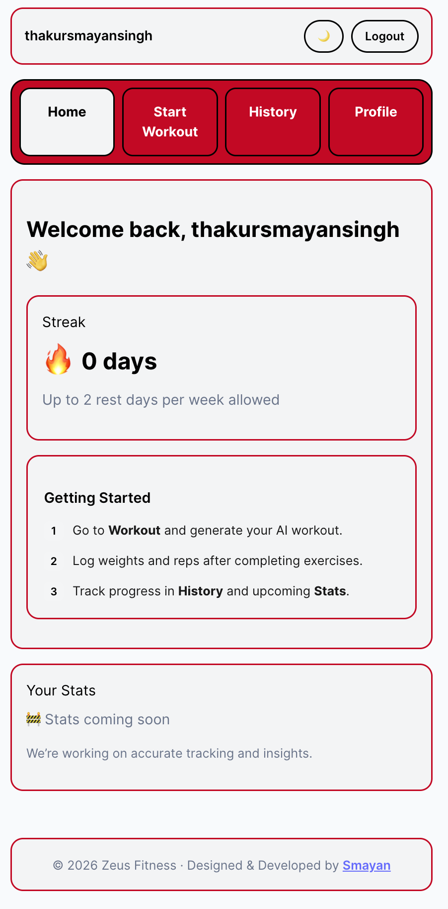

# 🔥 Zeus AI Fitness

A production-deployed AI-powered workout SaaS that dynamically generates structured training plans using an LLM-backed full-stack architecture.

<p align="center">
  
</p>

🌍 **Live App**  
https://zeus-ai-fitness-frontend.vercel.app/

⚙️ **Backend API**  
https://zeus-ai-backend.onrender.com/

---

## 🚀 Problem

Most beginner fitness users struggle with:

- Structured workout planning  
- Progressive overload tracking  
- Consistency tracking  
- Personalized workout generation  

Zeus AI Fitness solves this using an LLM-powered backend that dynamically generates structured workouts while tracking user performance and training history.

---

## 🏗 System Architecture

### Frontend (Vercel)

- React (Vite)
- Responsive UI
- Dark mode
- Animated transitions
- Environment-based API routing

### Backend (Render)

- Node.js
- Express
- Groq LLM integration
- Secure environment configuration
- Production CORS setup

### Database

- Supabase (PostgreSQL)
- Workout history storage
- User profile management

The system is fully environment-configured for both local development and production deployment.

---

## ✨ Key Engineering Features

- AI workout generation by muscle split
- A/B workout rotation logic
- Progressive overload calculation from historical data
- Exercise-level history modal
- Streak system with controlled rest-day allowance
- Environment-based API configuration
- Production CORS handling
- Secure `.env` separation
- Fully deployed full-stack architecture

---

## 🛠 Tech Stack

### Frontend
- React
- Vite
- CSS
- Framer Motion

### Backend
- Node.js
- Express
- Groq SDK
- dotenv

### Database
- Supabase (PostgreSQL)

### Deployment
- Vercel (Frontend)
- Render (Backend)

---

## 🔐 Environment Variables

### Backend

```env
PORT=
GROQ_API_KEY=
SUPABASE_URL=
SUPABASE_SERVICE_ROLE_KEY=
FRONTEND_URL=
```

### Frontend

```env
VITE_API_URL=
```

---

## 📈 Scaling & Product Roadmap

- Subscription layer (SaaS monetization)
- AI diet generator
- Advanced analytics dashboard
- PWA install capability
- Custom domain
- Usage tracking & user analytics

---

## 👨‍💻 Author

**Smayan Singh**  
Computer Science Engineer  
AI & Full Stack Developer  

LinkedIn:  
https://www.linkedin.com/in/smayansingh/
